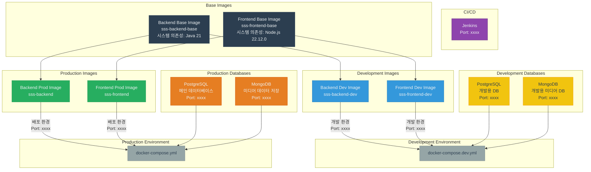

```mermaid
graph TD
    subgraph "CI/CD"
        JENKINS[Jenkins<br/>Port: xxxx]
    end

    subgraph "Base Images"
        BE_BASE[Backend Base Image<br/>sss-backend-base<br/>시스템 의존성: Java 21]
        FE_BASE[Frontend Base Image<br/>sss-frontend-base<br/>시스템 의존성: Node.js 22.12.0]
    end

    subgraph "Production Images"
        BE_PROD[Backend Prod Image<br/>sss-backend]
        FE_PROD[Frontend Prod Image<br/>sss-frontend]
    end

    subgraph "Development Images"
        BE_DEV[Backend Dev Image<br/>sss-backend-dev]
        FE_DEV[Frontend Dev Image<br/>sss-frontend-dev]
    end

    subgraph "Production Databases"
        POSTGRES_PROD[PostgreSQL<br/>메인 데이터베이스<br/>Port: xxxx]
        MONGODB_PROD[MongoDB<br/>미디어 데이터 저장<br/>Port: xxxx]
    end

    subgraph "Development Databases"
        POSTGRES_DEV[PostgreSQL<br/>개발용 DB<br/>Port: xxxx]
        MONGODB_DEV[MongoDB<br/>개발용 미디어 DB<br/>Port: xxxx]
    end

    BE_BASE --> BE_DEV
    BE_BASE --> BE_PROD
    FE_BASE --> FE_DEV
    FE_BASE --> FE_PROD

    BE_DEV --> |개발 환경<br/>Port: xxxx| DEV_ENV
    FE_DEV --> |개발 환경<br/>Port: xxxx| DEV_ENV
    BE_PROD --> |배포 환경<br/>Port: xxxx| PROD_ENV
    FE_PROD --> |배포 환경<br/>Port: xxxx| PROD_ENV

    subgraph "Development Environment"
        DEV_ENV[docker-compose.dev.yml]
    end

    subgraph "Production Environment"
        PROD_ENV[docker-compose.yml]
    end

    POSTGRES_PROD --> PROD_ENV
    MONGODB_PROD --> PROD_ENV
    POSTGRES_DEV --> DEV_ENV
    MONGODB_DEV --> DEV_ENV

    style BE_BASE fill:#2c3e50,stroke:#34495e,color:#ecf0f1
    style FE_BASE fill:#2c3e50,stroke:#34495e,color:#ecf0f1
    style BE_DEV fill:#3498db,stroke:#2980b9,color:#ecf0f1
    style FE_DEV fill:#3498db,stroke:#2980b9,color:#ecf0f1
    style BE_PROD fill:#27ae60,stroke:#219a52,color:#ecf0f1
    style FE_PROD fill:#27ae60,stroke:#219a52,color:#ecf0f1
    style POSTGRES_PROD fill:#e67e22,stroke:#d35400,color:#ecf0f1
    style MONGODB_PROD fill:#e67e22,stroke:#d35400,color:#ecf0f1
    style POSTGRES_DEV fill:#f1c40f,stroke:#f39c12,color:#2c3e50
    style MONGODB_DEV fill:#f1c40f,stroke:#f39c12,color:#2c3e50
    style JENKINS fill:#8e44ad,stroke:#6c3483,color:#ecf0f1
    style DEV_ENV fill:#95a5a6,stroke:#7f8c8d,color:#2c3e50
    style PROD_ENV fill:#95a5a6,stroke:#7f8c8d,color:#2c3e50

```