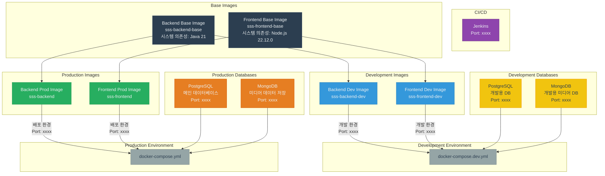

# 🚀 쇼쇼숓 - Docker 설정

1. [프로젝트 개요](#-프로젝트-개요)
2. [Docker 설정](#-docker-설정)
   - [사전 요구사항](#사전-요구사항)
   - [환경 설정](#환경-설정)
   - [실행 권한 부여](#실행-권한-부여)
   - [개발 환경 실행](#개발-환경-실행)
   - [배포 환경 실행](#배포-환경-실행)
   - [개별 서비스 실행 스크립트](#개별-서비스-실행-스크립트)
3. [도커 시스템 구조](#-도커-시스템-구조)
4. [시스템 의존성 관리](#-시스템-의존성-관리)
5. [Jenkins CI/CD 설정](#jenkins-cicd-설정)
6. [도커 컨테이너 구성](#️-도커-컨테이너-구성)
7. [도커 파일 구조](#-도커-파일-구조)
8. [포트 정보](#-포트-정보)
9. [개발 워크플로우](#-개발-워크플로우)
10. [주의사항](#️-주의사항)


## 📌 프로젝트 개요
사용자가 입력한 스토리를 기반으로 다양한 AI를 활용하여 숏폼 콘텐츠를 제작하는 웹 플랫폼을 개발합니다.

## 🏗 도커 시스템 구조



### 다이어그램 설명
- **Base Images**: 기본 시스템 의존성을 포함한 기초 이미지
- **Development Images**: 개발 환경에 최적화된 이미지 (핫 리로드 등 개발 편의 기능 포함)
- **Production Images**: 배포 환경에 최적화된 이미지
- **Development Databases**: 개발 환경용 데이터베이스 (PostgreSQL, MongoDB)
- **Production Databases**: 배포 환경용 데이터베이스 (PostgreSQL, MongoDB)
- **Environments**: 개발 및 배포 환경별 Docker Compose 설정

## 🐳 Docker 설정

### 사전 요구사항
- Docker 및 Docker Compose 설치
- Git

### 환경 설정
1. 프로젝트 클론
```bash
# 전체 프로젝트 클론
git clone https://lab.ssafy.com/s12-ai-speech-sub1/S12P21B106.git
cd S12P21B106

# 또는 특정 브랜치만 클론 (Dev/web 브랜치)
git clone -b Dev/web --single-branch https://lab.ssafy.com/s12-ai-speech-sub1/S12P21B106.git
cd S12P21B106
```

2. 환경 변수 파일 생성
```bash
cp .env.example .env
```

3. `.env` 파일을 열고 필요한 환경 변수 값을 설정합니다.

### 실행 권한 부여 
스크립트를 실행하기 전에 실행 권한을 부여해야 합니다. (permission denied 경우)
```bash
chmod +x run-backend.sh run-frontend.sh run-backend-dev.sh run-frontend-dev.sh stop-containers.sh
```

### 서비스 실행 방법 
- 1번과 2번 중 하나 선택 실행

#### 1. Docker Compose를 사용한 전체 서비스 실행
모든 서비스(백엔드, 프론트엔드, 데이터베이스)를 한 번에 실행합니다.

```bash
# 개발 환경 전체 실행
docker compose -f docker-compose.dev.yml up -d

# 또는 배포 환경 전체 실행
docker compose up -d
```

#### 2. 개별 서비스 실행 스크립트 사용
각 서비스를 독립적으로 실행할 수 있는 스크립트입니다.

##### 배포 환경 스크립트
```bash
# 백엔드 서비스 실행 (데이터베이스 포함)
./run-backend.sh

# 프론트엔드 서비스 실행
./run-frontend.sh
```

##### 개발 환경 스크립트
```bash
# 백엔드 개발 서비스 실행 (데이터베이스 포함)
./run-backend-dev.sh

# 프론트엔드 개발 서비스 실행
./run-frontend-dev.sh
```

#### 서비스 중지 및 삭제
```bash
# 모든 컨테이너 중지 및 삭제
./stop-containers.sh all

# 개발 환경 컨테이너만 중지 및 삭제
./stop-containers.sh dev

# 배포 환경 컨테이너만 중지 및 삭제
./stop-containers.sh prod

# 특정 서비스 중지 및 삭제 (예: 백엔드)
./stop-containers.sh backend

# 개발 환경의 특정 서비스 중지 및 삭제 (예: 프론트엔드)
./stop-containers.sh frontend dev
```

## 🔄 시스템 의존성 관리

프로젝트는 개발 환경과 배포 환경 간의 시스템 의존성(예: jdk, gradle, ffmpeg 등)을 일관되게 관리하기 위해 다음과 같은 접근 방법을 사용합니다:

1. **공통 기본 이미지**: 모든 시스템 의존성은 기본 Dockerfile(`Dockerfile.base`)에 정의됩니다.
2. **환경별 이미지 확장**: 개발 및 배포 환경은 이 기본 이미지를 확장하여 환경별 설정을 추가합니다.

### 새로운 시스템 의존성 추가 방법

1. 기본 Dockerfile 수정:
```bash
# 백엔드 의존성 추가
vi BE/Dockerfile.base
# 프론트엔드 의존성 추가
vi FE/Dockerfile.base
```

2. 이미지 재빌드:
```bash
./build-images.sh
```

3. 컨테이너 재시작:
```bash
# 개발 환경
docker compose -f docker-compose.dev.yml down
docker compose -f docker-compose.dev.yml up -d

# 또는 배포 환경
docker compose down
docker compose up -d
```

이 방식을 통해 개발 환경에서 추가한 시스템 의존성이 배포 환경에도 자동으로 적용됩니다.

### Jenkins CI/CD 설정
1. Jenkins 컨테이너 실행
```bash
cd jenkins
docker compose up -d
```
2. Jenkins 초기 설정
   - 브라우저에서 `http://localhost:8090` 접속
   - 초기 관리자 비밀번호 확인: `docker exec sss-jenkins cat /var/jenkins_home/secrets/initialAdminPassword`
   - 권장 플러그인 설치 및 관리자 계정 생성
3. Jenkins 파이프라인 설정
   - 새 파이프라인 작업 생성
   - SCM에서 Git 선택 및 저장소 URL 입력
   - Jenkinsfile 경로 지정: `Jenkinsfile`

## 🛠️ 도커 컨테이너 구성
- **Backend**: Java 21, Gradle 8.5, ffmpeg
- **Frontend**: Node.js 22.12.0, npm 10.9.0, ffmpeg
- **Database**: 
  - PostgreSQL 16 (메인 데이터베이스)
  - MongoDB 7.0 (미디어 데이터 저장)
- **CI/CD**: Jenkins LTS

## 📂 도커 파일 구조
```
📦 프로젝트 루트
├── 📂 BE
│   ├── 📄 Dockerfile        # 백엔드 배포 환경 도커 이미지 설정
│   ├── 📄 Dockerfile.base   # 백엔드 기본 이미지 설정 (시스템 의존성 포함)
│   ├── 📄 Dockerfile.dev    # 백엔드 개발 환경 도커 이미지 설정
├── 📂 FE
│   ├── 📄 Dockerfile        # 프론트엔드 배포 환경 도커 이미지 설정
│   ├── 📄 Dockerfile.base   # 프론트엔드 기본 이미지 설정 (시스템 의존성 포함)
│   ├── 📄 Dockerfile.dev    # 프론트엔드 개발 환경 도커 이미지 설정
├── 📂 jenkins
│   ├── 📄 docker-compose.yml # Jenkins 컨테이너 설정
├── 📄 docker-compose.yml    # 배포용 컴포즈 파일
├── 📄 docker-compose.dev.yml # 개발용 컴포즈 파일
├── 📄 .env.example          # 환경 변수 예제 파일
├── 📄 Jenkinsfile           # CI/CD 파이프라인 설정
├── 📄 build-images.sh       # 이미지 빌드 스크립트
├── 📄 run-backend.sh        # 백엔드 실행 스크립트
├── 📄 run-frontend.sh       # 프론트엔드 실행 스크립트
├── 📄 run-backend-dev.sh    # 백엔드 개발 환경 실행 스크립트
├── 📄 run-frontend-dev.sh   # 프론트엔드 개발 환경 실행 스크립트
├── 📄 stop-containers.sh    # 컨테이너 중지 및 삭제 스크립트
└── 📄 README.md             # 프로젝트 설명서
``` 

## 📝 포트 정보
- **백엔드 API**: http://localhost:8080
- **프론트엔드 (배포)**: http://localhost:80
- **프론트엔드 (개발)**: http://localhost:3000
- **데이터베이스**: localhost:5432
- **Jenkins**: http://localhost:8090

## 🔄 개발 워크플로우

1. 개발 환경 컨테이너 실행
2. 로컬에서 코드 수정 (BE 또는 FE 디렉토리)
3. 변경 사항 확인:
   - 백엔드: `http://localhost:8080`
   - 프론트엔드: `http://localhost:3000` (서버 초기화에 약 10초 소요)
4. 개발 완료 후 컨테이너 중지
5. 커밋 후 푸시 

## ⚠️ 주의사항

- 동일한 포트를 사용하는 서비스가 이미 실행 중인 경우 포트 충돌이 발생할 수 있습니다.
- 개발 환경과 배포 환경을 동시에 실행할 경우 포트 충돌이 발생할 수 있으므로 주의하세요.
- 데이터베이스 데이터는 Docker 볼륨에 저장되므로, 볼륨을 삭제하면 데이터가 손실됩니다.
- 프론트엔드 개발 서버는 초기화에 약 20초 정도 소요됩니다. 스크립트 실행 후 잠시 기다려주세요. (너무 오래 걸리는 경우 컨테이너 로그 확인으로 진행 상황 확인 가능)