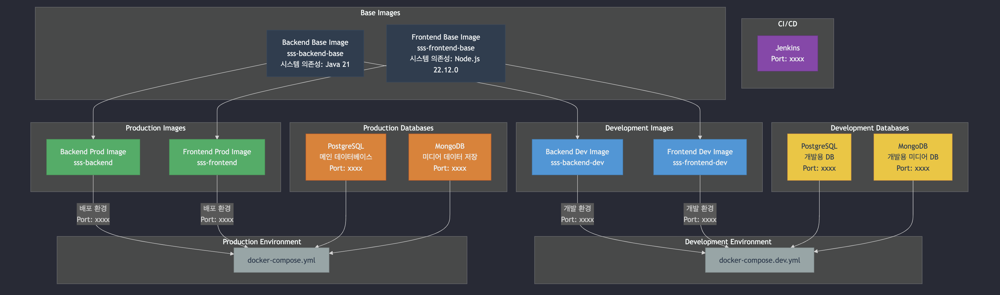

# 쇼쇼숏 - Docker 개요

- [쇼쇼숏 - Docker 개요](#쇼쇼숏---docker-개요)
  - [1. 프로젝트 개요](#1-프로젝트-개요)
  - [2. 도커 시스템 구조](#2-도커-시스템-구조)
    - [다이어그램 설명](#다이어그램-설명)
  - [3. 도커 컨테이너 구성 (Dev)](#3-도커-컨테이너-구성-dev)
  - [4. 도커 파일 구조](#4-도커-파일-구조)
  - [⚠️ 주의사항](#️-주의사항)

> 📝 **참고**: Docker 개발 환경 설정은 [README.dev.md](README.dev.md)를, 배포 환경 설정은 [README.prod.md](README.prod.md)를 참고하세요.

## 1. 프로젝트 개요
사용자가 입력한 스토리를 기반으로 다양한 AI를 활용하여 숏폼 콘텐츠를 제작하는 웹 플랫폼을 개발합니다.

## 2. 도커 시스템 구조


### 다이어그램 설명
- **Base Images**: 기본 시스템 의존성을 포함한 기초 이미지
- **Development Images**: 개발 환경에 최적화된 이미지 (핫 리로드 등 개발 편의 기능 포함)
- **Production Images**: 배포 환경에 최적화된 이미지
- **Development Databases**: 개발 환경용 데이터베이스 (PostgreSQL, MongoDB)
- **Production Databases**: 배포 환경용 데이터베이스 (PostgreSQL, MongoDB)
- **Environments**: 개발 및 배포 환경별 Docker Compose 설정

## 3. 도커 컨테이너 구성 (Dev)
- **Backend**: Java 21, Gradle 8.5
- **Frontend**: Node.js 22.12.0, npm 10.9.0
- **Database**: 
  - PostgreSQL 16 (메인 데이터베이스)
  - MongoDB 7.0 (미디어 데이터 저장)
- **CI/CD**: Jenkins LTS

## 4. 도커 파일 구조
```
📦 프로젝트 루트
├── 📂 BE
│   ├── 📄 Dockerfile        # 백엔드 배포 환경 도커 이미지 설정
│   ├── 📄 Dockerfile.base   # 백엔드 기본 이미지 설정 (시스템 의존성 포함)
│   ├── 📄 Dockerfile.dev    # 백엔드 개발 환경 도커 이미지 설정
├── 📂 FE
│   ├── 📄 Dockerfile        # 프론트엔드 배포 환경 도커 이미지 설정
│   ├── 📄 Dockerfile.base   # 프론트엔드 기본 이미지 설정 (시스템 의존성 포함)
│   ├── 📄 Dockerfile.dev    # 프론트엔드 개발 환경 도커 이미지 설정
├── 📂 jenkins
│   ├── 📄 docker-compose.yml # Jenkins 컨테이너 설정
├── 📄 docker-compose.yml    # 배포용 컴포즈 파일
├── 📄 docker-compose.dev.yml # 개발용 컴포즈 파일
├── 📄 .env.example          # 환경 변수 예제 파일
├── 📄 Jenkinsfile           # CI/CD 파이프라인 설정
├── 📄 build-images.sh       # 이미지 빌드 스크립트
├── 📄 run-backend.sh        # 백엔드 실행 스크립트
├── 📄 run-frontend.sh       # 프론트엔드 실행 스크립트
├── 📄 run-backend-dev.sh    # 백엔드 개발 환경 실행 스크립트
├── 📄 run-frontend-dev.sh   # 프론트엔드 개발 환경 실행 스크립트
├── 📄 stop-containers.sh    # 컨테이너 중지 및 삭제 스크립트
└── 📄 README.md             # 프로젝트 설명서
``` 

## ⚠️ 주의사항

- 동일한 포트를 사용하는 서비스가 이미 실행 중인 경우 포트 충돌이 발생할 수 있습니다.
- 개발 환경과 배포 환경을 동시에 실행할 경우 포트 충돌이 발생할 수 있으므로 주의하세요.
- 데이터베이스 데이터는 Docker 볼륨에 저장되므로, 볼륨을 삭제하면 데이터가 손실됩니다.
- 프론트엔드 개발 서버는 초기화에 약 20초 정도 소요됩니다. (너무 오래 걸리는 경우 컨테이너 로그 확인으로 진행 상황 확인 가능)