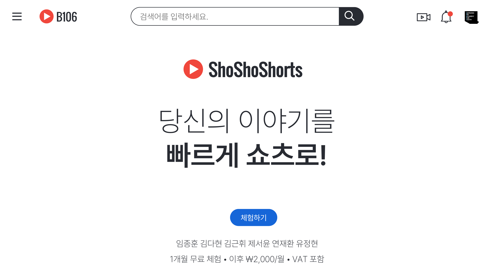
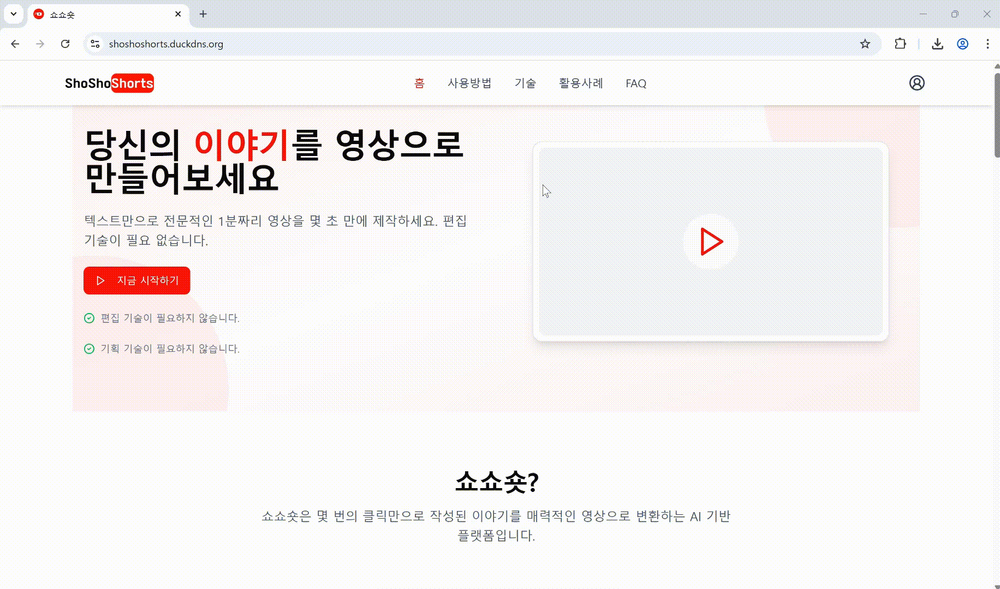
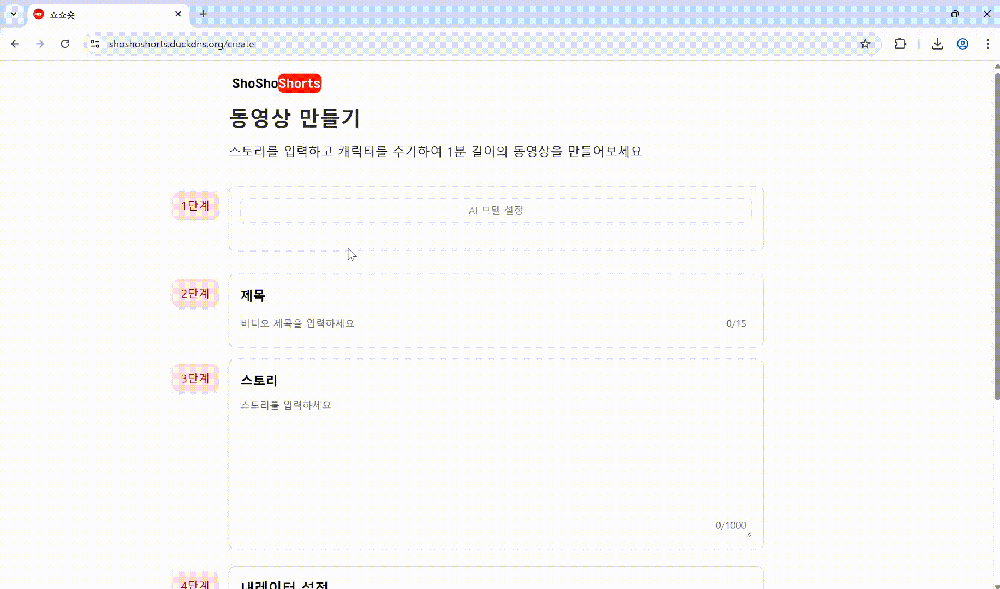
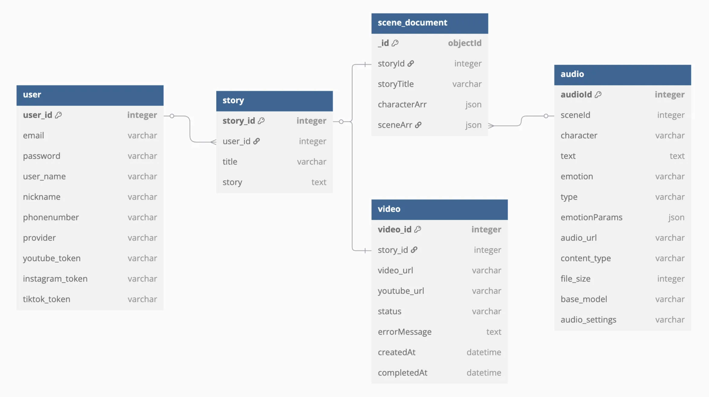
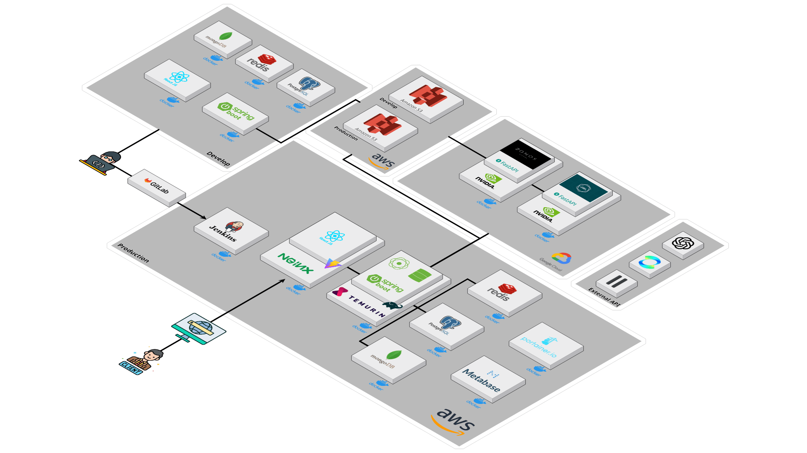

# 💡 쇼쇼숏

<br><br>


# 📋 목차
[개요](#-개요)<br>
[팀원](#-팀원) <br>
[서비스](#-서비스) <br>
[기술 스택](#-기술-스택) <br>
[화면](#-화면) <br>
[기술적 특징](#-기술적-특징) <br>
[문서](#-문서) <br>
<br>

# 📢 개요
* 프로젝트 명: 쇼쇼숏
* 프로젝트 기간: 2025.02.24 - 2025.04.11
* 프로젝트 주관: 삼성 청년 SW/AI 아카데미 

<br>


# 👨‍👩‍👦‍👦 팀원
<table>
 <th>AI / Frontend (팀장)</th>
 <th>Frontend</th>
 <th>AI / Infra</th>
 <tr>
    <td align="center"><a href="https://github.com/ImJongHoon"></a></td>
    <td align="center"><a href="https://github.com/allstring"></a></td>
     <td align="center"><a href="https://github.com/Ja-efan"></a></td>
    
  </tr>
  <tr>
    <td align="center"><b>ImJongHoon</b></td>
    <td align="center"><b>allstring</b></td>
    <td align="center"><b>Ja-efan</b></td>
  </tr>
  <tr> 
    <td align="center">임종훈</td>
    <td align="center">김다현</td>
    <td align="center">연재환</td>
  </tr> 
</table>
<table>
 <th>Backend</th>
 <th>Backend</th>
 <th>Backend</th>
 <tr>
    <td align="center"><a href="https://github.com/geunhh"></a></td>
    <td align="center"><a href="https://github.com/Junghyun58"></a></td>
     <td align="center"><a href="https://github.com/Jeseoyun"></a></td>
  </tr>
  </tr>
  <tr>
    <td align="center"><b>geunhh</b></td>
    <td align="center"><b>Junghyun58</b></td>
    <td align="center"><b>Jeseoyun</b></td>
  </tr>
  <tr> 
    <td align="center">김근휘</td>
    <td align="center">유정현</td>
    <td align="center">제서윤</td>
  </tr> 
</table>
     
<br>
        
# 🔍 서비스
### [사용자 스토리 기반 숏폼 콘텐츠 제작 플랫폼]

#### 1. 사용자 스토리 기반 숏폼 제작 <br>
* 사용자가 작성한 스토리를 기반으로 1분 내외의 숏폼 콘텐츠를 제작

#### 2. 보이스 클로닝  <br>
* 최신 TTS 모델 (Zonos TTS)을 활용한 보이스 클로닝 제공 
* 사용자가 등록한 목소리를 활용한 숏폼 제작 

#### 3. 유튜브 업로드 <br>
* 생성된 숏폼 콘텐츠를 유튜브에 업로드


<br><br>

# 🛠 기술 스택
### 🎨 FrontEnd
<p align="left">
    
    
    
    
<br>
    
    
    
    
</p>

### 🖥️ BackEnd
<p align="left">
	
	
	
	
	
 
</p>

### ✨ AI 
<p align="left">
 
        
 
        
 
        
 
        
 

 
</p>
      
        
### 📦 Storage (Database) 
<p align="left">
 
        
 

 
 
 

</p>

        
### ☁️ Infra
<p align="left">
        
 
 
 
 
        
  <br>
        
     
        
 
 
     
</p>

        
### 🛠️ Tool
<p align="left">
	
	
	
	<br>
	
	
	
        
        
</p>

        
<br>

<br>

# 💻 화면

<br>

## 1. 메인
| 기능 | 화면 |
|------|------|
| 메인화면 |  |

<br>


## 2. 숏폼 제작
| 기능 | 화면 |
|------|------|
| 모델 선택 |  |
| 사용자 스토리 입력 |  |
| 캐릭터 입력 |  |

<br>

## 3. 대시보드
| 기능 | 화면 |
|------|------|
| 전체 |  |
| 유튜브 업로드  |  |

<br>

## 4. 마이페이지
| 기능 | 화면 |
|------|------|
| 목소리 등록<br> (보이스 클로닝) |  |

<br><br><br>


# 🚀 기술적 특징
## 메인 페이지
**[FE]** 
- 인증 상태 관리
    ```
    const checkAuth = async () => {
      try {
        const token = localStorage.getItem('token');
        if (token) {
          // 토큰 유효성 검사
          const response = await apiService.validateToken(token);
          if (response.valid) {
            setIsAuthenticated(true);
            setUser(response.user);
          } else {
            // 토큰이 유효하지 않으면 로그아웃
            localStorage.removeItem('token');
            setIsAuthenticated(false);
            setUser(null);
          }
        }
      } catch (error) {
        console.error('인증 확인 중 오류:', error);
        setIsAuthenticated(false);
        setUser(null);
      } finally {
        setLoading(false);
      }
    };
    ```
- 토큰 기반 자동 로그아웃 시스템
    - 15분마다 토큰 유효성 검사
    - 만료 시 자동 로그아웃 및 리다이렉트
- 로그인 상태에 따른 동적 UI 변경
    - 네비게이션 바 변경
    - CTA 버튼 변경
    - 접근 제한 기능
- 섹션별 컴포넌트 구조
    - HeroSection: 그라데이션 배경과 반응형 디자인
    - WhatIsSection: 인터랙티브 카드 레이아웃
    - HowItWorksSection: 애니메이션 기반 단계 표시
    - TechnologySection: 기술 스택 시각화
    - UseCasesSection: 사용 사례 갤러리
    - FAQSection: 아코디언 스타일 Q&A
    - CTASection: 행동 유도 섹션
- 성능 최적화
    - 이미지 최적화
    - WebP 포맷 사용
    - 지연 로딩 적용
    - 반응형 이미지 크기
- 컴포넌트 최적화
    - 섹션별 코드 스플리팅
    - 불필요한 리렌더링 방지
- 반응형 디자인
    - 모바일 퍼스트 접근
    - 그리드 시스템
    - 유동적 타이포그래피
    - 미디어 쿼리 최적화
## 숏폼 생성
**[FE]** 
- 음성 제어
    ```
    useEffect(() => {
  // 다른 음성이 재생되거나 상태가 변경될 때 현재 음성 중지
      if (audioRef.current && 
          (currentlyPlaying.characterId !== character.id || 
           currentlyPlaying.voiceOption === null)) {
        stopAudio()
      }
    }, [currentlyPlaying, character.id])    
    ```

    ```
    const handlePlayVoice = (voiceOption: string) => {
      // 1. 현재 재생 중인 소리 중지
      stopAudio()

      // 2. 같은 음성 재클릭 시 정지
      if (currentlyPlaying.voiceOption === voiceOption && 
          currentlyPlaying.characterId === character.id) {
        setCurrentlyPlaying({ voiceOption: null, characterId: null })
        return
      }

      // 3. 나레이터 음성 중지
      if (narratorRef && narratorRef.current) {
        narratorRef.current.stopAudio()
      }

      // 4. 새로운 음성 재생
      setCurrentlyPlaying({ voiceOption, characterId: character.id })
      // ... 음성 재생 로직
    }
    ```
    - 단일 음성 재생: 한 번에 하나의 음성만 재생
    - 자동 정지: 다른 음성 재생 시 현재 음성 자동 정지
    - 나레이터 음성 연동: 캐릭터 음성 재생 시 나레이터 음성 자동 정지
    - 재생 상태 표시: 현재 재생 중인 음성 시각적 표시
    - 음성 타입별 분류: 성별에 따른 음성 옵션 분류
        
- 에러 처리
    - 유효성 검사
    - 필수 입력 필드 검증
    - 문자 수 제한 검증
    - 캐릭터 정보 검증
- 에러 피드백
    - Toast 메시지
    - 시각적 피드백
    - 에러 상태 표시

**[BE]**
- AI로부터 생성된 음성·이미지 파일을 Scene 단위로 병합해 하나의 영상으로 생성
    ```
       영상
        │
        ├── 장면 1 
        │    ├── 이미지 1
        │    │     └──  음성 A
        │    │     └──  음성 B
        │    │     └──  ...
        │    ├── 이미지 2
        │    │     └── ...
        │    └── ...
        │
        ├── 장면 N
              
    ```
- 비동기 처리를 통해 사용자 대기 시간을 최소화하고 서비스 응답성 향상
    - 영상 생성에 필요한 최소 데이터만 저장한 뒤, 나머지 처리(스크립트 변환, 미디어 생성, 병합 등)는 비동기적으로 수행하여 사용자 경험 향상
    - 음성 및 이미지 생성 요청도 각각 비동기 방식으로 처리해 전체 성능 최적화
    - 미디어 생성 작업별 커스텀 스레드 풀 설정을 통한 처리 성능 향상
- FFmpeg 외부 명령어 호출 로직을 별도 클래스(`FFmpegExecutor`)로 분리해 영상 합성 프로세스 설계
    - 병합된 영상에 배경 이미지, 자막, 배경 음악을 추가해 콘텐츠 완성도 향상
- 재시도 기능 지원
    - 영상 생성 중 에러발생 시 재시도 기능 지원
    - 기존 이미지/오디오 파일이 있을 경우 자동 재사용
- 유튜브 업로드 기능 지원
    - 구글 OAuth 인증을 통해 업로드 권한 설정
    - HttpOnly 쿠키를 활용하여 토큰 별도 관리
    - Default 설정으로 사용자의 별도 처리 없이 업로드 가능


**[AI]** 
- [스크립트]
    - 스토리와 인물 정보를 입력받아 대사, 인물, 감정을 포함하는 스크립트 생성 (gpt-4o-mini)
- [음성] 
    - 생성된 스크립트를 기반으로 한 TTS
        - elevenlabs API 활용 
        - Zonos 로컬 모델
- [영상] 
    - KLING AI API를 활용한 이미지 생성 
    - 각 장면(scene) 정보를 기반으로 이미지 프롬프트 작성 (gpt-4o)
    - 그림체 별로 독립적인 시스템 프롬프트를 구성 (Pixar, Disney, etc.)
    - 일관된 이미지 프롬프트 생성을 위한 체계적인 시스템 프롬프트 작성 (프롬프트 엔지니어링)
        - 이전 장면 정보 분석
        - 현재 장면 정보 분석
        - 캐릭터 정보 분석
        - 카메라 구도 선택
        - 인물 간 관계 정리 
        - 장소 및 배경 설정 
        - 조명 및 색감 조율 
    - 생성된 이미지는 S3 업로드 후 S3 URL 반환

        
## 대시보드
**[FE]** 
- 비디오 상태 관리 시스템
    ```
    // 비디오 상태 분류
    const { inProgressVideos, completedVideos, failedVideos } = useMemo(() => {
      const filteredVideos = videos.filter((video) =>
        video.title.toLowerCase().includes(searchQuery.toLowerCase())
      );

      return {
        inProgressVideos: filteredVideos.filter(
          (video) => video.status === "PENDING" || video.status === "PROCESSING"
        ),
        completedVideos: filteredVideos.filter(
          (video) => video.status === "COMPLETED"
        ),
        failedVideos: filteredVideos.filter(
          (video) => video.status === "FAILED"
        ),
      };
    }, [videos, searchQuery]);
    ```
    - SSE를 통한 비디오 상태 분류
    - 실시간 상태 업데이트
    - 메모이제이션을 통한 성능 최적화
- 검색 및 필터링 시스템
    ```
    const [searchQuery, setSearchQuery] = useState("");

    // 검색어 기반 필터링
    const filteredVideos = videos.filter((video) =>
      video.title.toLowerCase().includes(searchQuery.toLowerCase())
    );
    - 실시간 검색
    - 대소문자 구분 없는 검색
    - 검색 결과에 따른 UI 업데이트
    ```
**[BE]**
- 영상 처리 진행 상황을 Redis에 저장하고, SSE를 통해 프론트엔드에 실시간 push 전송
- 대시보드에서 영상 생성 상태를 실시간으로 모니터링할 수 있도록 구현


## 보이스 클로닝
**[FE]** 
- 파일 업로드 시스템
    - MP3 파일 업로드 지원
    - base64 인코딩 변환
    - 비동기 파일 처리
- 업로드 프로세스
    - 중복 제출 방지
    - 파일 변환 및 업로드
    - 성공/실패 처리
    - 자동 목록 갱신

**[BE]**
- 사용자 음성 파일(Base64)을 받아 AI서버(FastAPI)로 **보이스 클로닝 요청**을 보내고, 
**보이스 임베딩 텐서** 및 **S3 URL**을 저장 및 전달하는 로직 구현   
- 텐서값은 JSON -> byte[] 방식으로 RDB에 저장되어 효율적 데이터 관리
- 저장된 음성 S3 URL는 **presigned URL**로 변환하여 사용자에게 전달
- 사용자는 마이페이지에서 등록된 음성을 조회 및 삭제 가능

**[AI]**
- [음성]
    - 샘플 보이스 임베딩 벡터를 활용한 보이스 클로닝 
    - 임베딩 백터 캐싱을 활용한 15% 시간 단축 최적화


## 마이페이지
**[FE]** 
- UI 컴포넌트 구조
    - 반응형 그리드 레이아웃
    - 카드 기반 UI
    - 모듈화된 컴포넌트
- 프로필 이미지 처리
    - 조건부 렌더링
    - 폴백 UI
    - 반응형 이미지 처리
- 토큰 사용량 표시
    - 프로그레스 바
    - 토큰 타입별 구분
    - 사용량 시각화
- 이름 수정 기능
    - 모달 기반 수정
    - 유효성 검사
        
        
        
## 기타
**[인프라]**
- GitLab Webhook 과 Jenkins 를 이용한 배포 자동화 
- Docker를 활용한 서버 별 컨테이너 구조
- Dockerfile.base 를 확장한 개발환경(Dockerfile.dev)과 배포환경(Dockerfile) 구분
- 리버스 프록시를 위한 Nginx 활용 
- Portainer를 활용한 배포 서버 로그 관리


<br><br><br>

# 📕 문서
[요구사항 명세서](https://jaefan.notion.site/1d5d2e168cd38103961de91ac62bda30?source=copy_link) <br>
[와이어프레임](https://www.figma.com/design/4AuUnpNa0wpGhMSpf5CdYe/zonos?node-id=0-1&p=f&t=9RQ0TmVSkLQb9OSA-0) <br>
[기능명세서](https://jaefan.notion.site/1d5d2e168cd381fca5ddfd9b9fc4ed2f?source=copy_link) <br>
[API 명세서](https://jaefan.notion.site/API-1d5d2e168cd3818eac34cc19d86389bc?source=copy_link) <br>

### ERD


### 아키텍쳐


### 깃 컨벤션
> | HEAD | 설명 |
> | --- | --- |
> | `feat` | 새로운 기능 추가 |
> | `fix` | 버그 수정 |
> | `docs` | 문서 수정 |
> | `style` | 코드 formatting, 세미콜론 누락, 코드 자체의 변경이 없는 경우, 주석 없거나, 파일 또는 폴더 명 수정 |
> | `refactor` | 코드 리팩토링 |
> | `test` | 테스트 코드 |
> | `design` | CSS 등 사용자 UI 디자인 변경 |
> | `remove` | 파일을 삭제하는 작업만 수행한 경우 |
> | `hotfix` | 급하게 수정해야 할 버그 |
> | `chore` | 기타 수정사항 |


**브랜치 명**
> *   Protected: `master`, `release`, `dev`(`-be`, `-fe`, `-ai`)
> *   `{head}/{part}/{jira}/{description}`
> *   구분은 '/', 띄어쓰기는 '-'
> *   ex) `feat/fe/s12p31b105-15/OAuth-login`

**커밋 메시지**

> ```
> {HEAD}: {Title}
>
> - Description
> 
> #{JIRA_ISSUE_NUMBER}
>```
> ```
> # example 
>
> feat: 로그인 기능 구현 
> 
> - OAuth 구글 로그인 기능 구현 
> 
> #S12P31B105-15
> ```
> *   기능별로 커밋 ex) 로그인 기능 구현, 로그아웃 기능 구현 